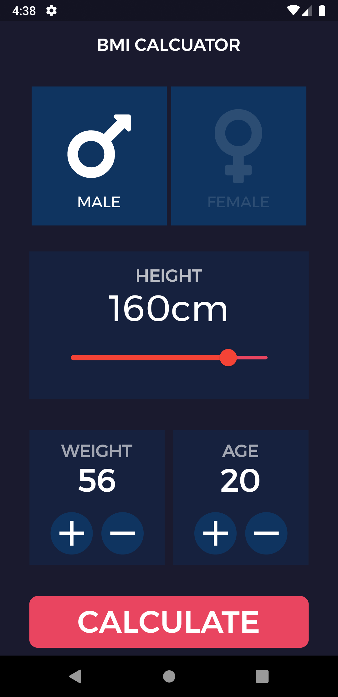

# BMI CALCULATOR

## Inspiration

Lot people don't about their body weight. BMI is used for getting know your Body weight and height. This App is a BMI calculator which calculates the BMI and classifies the person as Underweight, Normal weight, Overweight, etc. This app is built using Flutter, because of which it will available both on Android and IOS.

## What it does

This App takes allows user to select his gender, height, weight and age. Then it calculates the BMI with the formula , BMI = (weight)/(height*height). After calculating the BMI it classifies the person as Underweight, Normal weight, Overweight, Obese, etc. It displays the result, range of BMI and a short message for the user.

## How I built it

I have used Flutter framework and Dart language to built this app. I have also referred sites like Pinterest, Dribble, etc. for design. Flutter helps a lot in designing the UI.

## Challenges I ran into

The main challenge was managing the state of the app and passing the values from one screen to another. But with the help of official documentation of Flutter and stack overflow I overcome the challenges.

## Accomplishments that I'm proud of

I'm proud that I have successfully designed a beautiful UI and implemented state management in flutter.

## What I learned

I have learned about how to design custom widgets, how to implement dark theme and state management.

## What's next for BMI Calculator

In future I'll try to make the available on web and I'll try to host it using GitHub pages.

## Screenshots
  &emsp;  

